# Orbital-Sim: Fault-Tolerant Distributed AI Uplink

**Orbital-Sim** is a distributed microservices architecture designed to simulate the operational constraints of a space-based AI training cluster.

Unlike terrestrial RAG (Retrieval-Augmented Generation) systems, this project explicitly models the physics of the Starcloud architecture: **high-latency uplinks**, **thermal radiative cooling limits**, and **batch-processing power budgets**.

---

## 🚀 System Architecture

The system consists of three Dockerized microservices orchestrated via `docker-compose` to enforce strict network isolation between Earth and Orbit.


### 1. Ground Station (The Client)

**Role:** Simulates the terrestrial interface for uploading large training jobs.

**Physics Implemented:** Data Shuttle Protocol. Large datasets cannot be streamed instantly. The system mimics the packaging of physical storage media ("Data Shuttles") and the associated launch delays, as described in the Starcloud white paper for transporting exabytes of data.

### 2. Uplink Service (The Chaos Proxy)

**Role:** Middleware that enforces orbital network constraints.

**Physics Implemented:**
- **Variable Latency:** Injects 500ms–2000ms delays to mimic RF/Optical alignment and processing time.
- **Packet Loss:** Randomly drops packets to simulate Loss of Signal (LOS) or atmospheric interference.

### 3. Orbital Node (The Satellite)

**Role:** The compute worker running Microsoft Semantic Kernel.

**Physics Implemented:** Stefan-Boltzmann Thermal Throttling.
- Space is a vacuum; heat rejection is limited by the radiator's surface area.
- The system calculates heat rejection ($P_{radiated}$) based on the radiator's temperature ($T^4$) using the Stefan-Boltzmann law: $P = \epsilon \sigma T^4$
- **Logic:** If the node temperature exceeds $80^{\circ}C$ (353.15K), the system rejects new compute jobs (HTTP 503) to prevent hardware damage.

---

## 📡 Operational Sequence (Logic Flow)

The following sequence illustrates how the system handles a "Job" while respecting physics constraints.

```mermaid
sequenceDiagram
    participant User
    participant GS as Ground Station
    participant UP as Uplink (Chaos)
    participant SAT as Orbital Node
    participant RAD as Thermal Manager

    User->>GS: POST /upload_job (Payload)
    Note over GS: 📦 Package Data Shuttle<br/>(Simulate Launch Logistics)
    GS->>GS: Wait 3s (Launch Window)
    GS->>UP: Transmit Manifest
    
    Note over UP: 🎲 Inject Latency (500ms-2s)<br/>🎲 Roll for Packet Loss
    UP->>SAT: Forward Payload
    
    SAT->>RAD: check_thermal_headroom()
    alt Radiator Temp > 80°C
        RAD-->>SAT: 🚫 REJECT (Thermal Throttling)
        SAT-->>UP: 503 Service Unavailable
    else System Nominal
        RAD-->>SAT: ✅ APPROVED
        SAT->>SAT: Run Semantic Kernel (AI)
        Note over SAT: 🔥 Generate Heat (Simulated Load)
        SAT-->>UP: 200 OK (Result)
    end
    
    UP-->>GS: Return Telemetry
    GS-->>User: Mission Complete
```



---

## 🛠️ Technology Stack

| Component | Technology |
|-----------|------------|
| **Language** | Python 3.12 (Strict typing, Pydantic validation) |
| **AI Framework** | Microsoft Semantic Kernel (Azure OpenAI Integration) |
| **Infrastructure** | Docker Compose (Isolated Networks) |
| **Frontend** | Mission Control Dashboard (HTML5/CSS3/JavaScript) |
| **Testing** | Pytest (Physics verification) |

---

## ⚡ How to Run

### 1. Prerequisites

- Docker & Docker Compose
- Azure OpenAI API Key (or compatible LLM endpoint)

### 2. Configuration

Create a `.env` file in the root directory:

```ini
AZURE_OPENAI_API_KEY=your_key_here
AZURE_OPENAI_ENDPOINT=your_endpoint_here
AZURE_OPENAI_DEPLOYMENT_NAME=gpt-4
```

### 3. Launch the Constellation

```bash
docker-compose up --build
```

### 4. Access Mission Control

Open your browser and navigate to:

```
http://localhost:8000
```

The **Mission Control Dashboard** provides:
- 🌡️ Real-time thermal telemetry display
- 🚀 Interactive job submission form
- 📋 Live mission log with status updates
- 📡 System health monitoring

### 5. Execute a Mission (CLI)

Alternatively, use curl to submit jobs directly:

```bash
curl -X POST "http://localhost:8000/upload_job" \
     -H "Content-Type: application/json" \
     -d '{"dataset_snippet": "Telemetry: Solar Array B efficiency down 0.4%. Requesting anomaly detection analysis.", "priority": "HIGH"}'
```

---

## 🧪 Verification & Testing

To validate the physics engine, run the test suite inside the container:

```bash
docker-compose exec orbital-node pytest tests/
```

**Key Tests:**

- `test_stefan_boltzmann_accuracy`: Validates that heat rejection matches the Starcloud White Paper calculations ($\sim385 W/m^2$ at $20^{\circ}C$).
- `test_overheating_trip`: Ensures the system throws a `ThermalThrottlingException` when pushed beyond the $80^{\circ}C$ safety limit.

---

**Author:** L. Elaine Dazzio